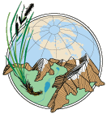

```{r setup, include=FALSE}
knitr::opts_chunk$set(echo = TRUE)
```

## Research Projects
- [Markdown Lesson](Rmd/rmarkdown-lesson.html)
- [Data Tidying](Rmd/data-tidying.html)
- [Data Visualization](Rmd/data-visualization.html)
- [Data Cleaning and Manipulating Data Challenge](Rmd/cleaning-manipulating-data.html)
- [Geospatial Vector Analysis - maps with ggmap and leaflet](Rmd/geospatial-vector-analysis.html)

